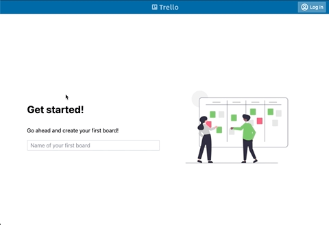

## Trello App — Workshop Project

<p align="center" width="100%">
    
</p>

A Trello clone built with React + TypeScript + Vite + TailwindCSS, used for testing workshops.

## Installation

Run the setup command in your terminal:

```bash
bash <(curl -fsSL https://raw.githubusercontent.com/filiphric/trelloapp-vue-vite-ts/main/setup.sh)
```

The installer will:
1. Check that you have `git`, `node` (v20+) and `npm` installed
2. Clone the project and set up a clean git history
3. Ask you to choose between **Full install** (with tests) or **Clean install** (app only)
4. Install dependencies and verify everything works

Once done, start the app:

```bash
cd trelloapp
npm start
```

The app will be running at [http://localhost:3000](http://localhost:3000).

### Manual installation

If you prefer to set things up yourself:

```bash
git clone https://github.com/filiphric/trelloapp-vue-vite-ts.git trelloapp
cd trelloapp
npm install
cp .env_example .env
npm start
```

### Troubleshooting

If the setup fails (common on work machines with restricted permissions):
- Ask your system administrator to install **git** and **Node.js v20+**
- If your company uses a VPN or proxy, ask IT to allowlist `github.com` and `registry.npmjs.org`
- Contact the workshop instructor for help
