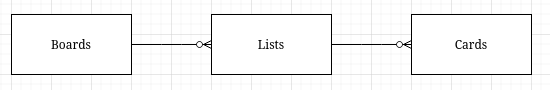
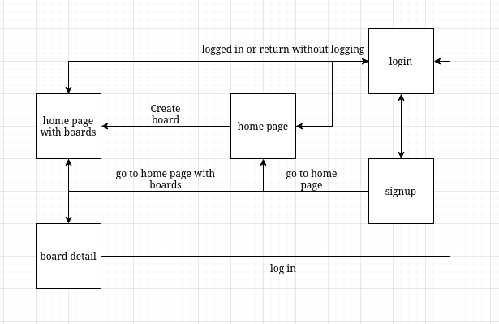
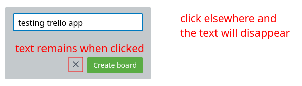
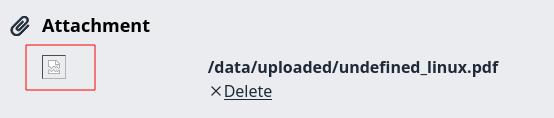
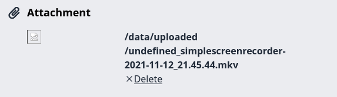
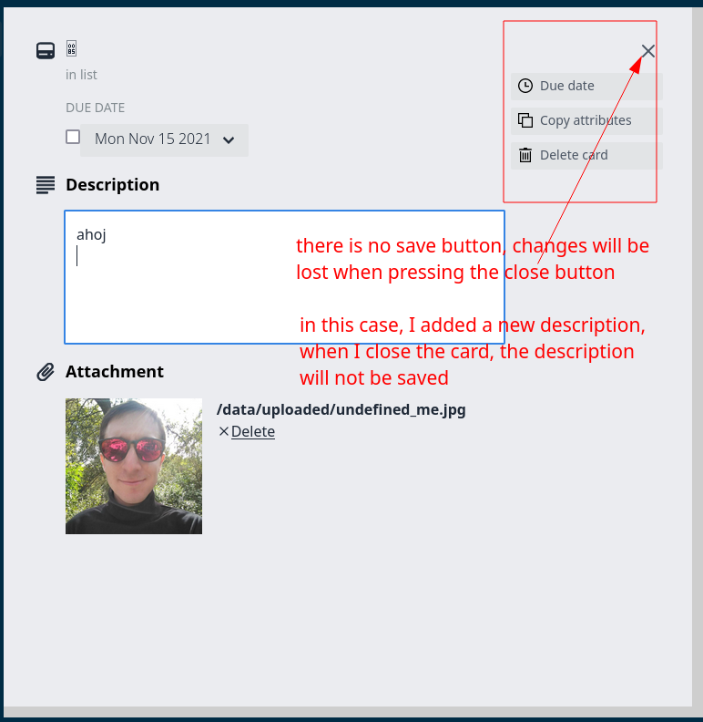
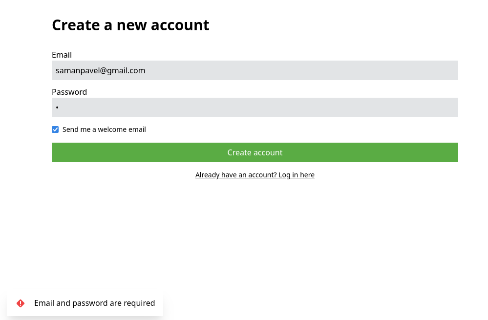
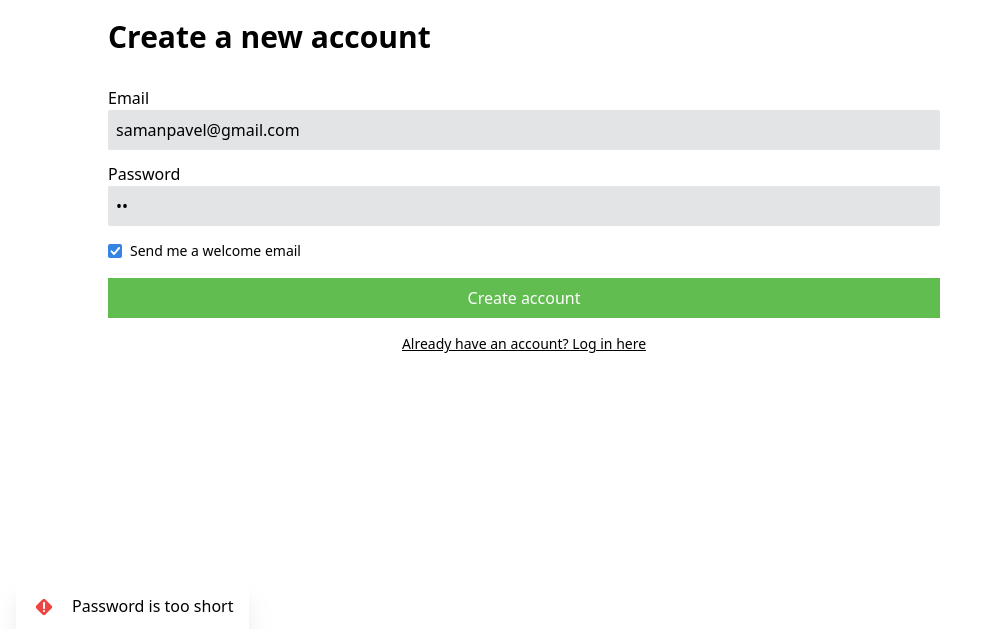
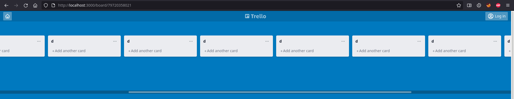
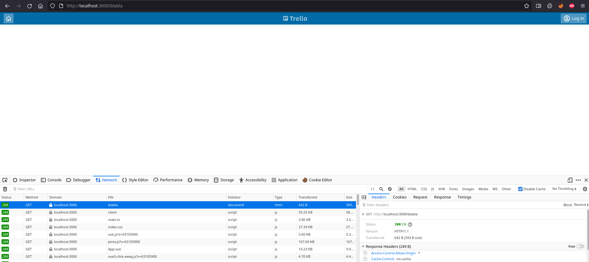

# Test Session Report

## __Mission__

Explore and experience the application and API in order to gain knowledge (business, technical) so I can test more deeply the application later on.

## __Datetime__

12/11/2021 21:30

## __Duration__

2.5h - installation, FE app discovery, feature discovery, little bit of API discovery, cypress setup, some database seeds prepared

## __Testers__

Pavel Saman

## __Test execution time__

~ 20 %

## __Bug investigation time__

~ 50 %

## __Setup & admin time__

~ 30 %

## __Environment__

- firefox 94.0.1-1
- Postman 9.1.3
- FE app and API running on localhost
- Linux 5.14.16-artix1-1
- Xfce4 desktop environment

## __Notes__

Feature list:

- log in (why does it say welcome back when I never been here?)
- sign up => logged in
- log out
- boards:
  - board creation => takes me to `/board/:id`
    - API: `/api/boards` with `Accept: application/json` header
  - add board to starred
    - from board detail
    - from homepage
  - board deletion
- lists:
  - list creation
  - list deletion
- cards:
  - card creation
  - card deletion
  - mark card as completed
  - write description to a card
  - copy attributes to clipboard
  - add attachments
  - change name
  - red date when overdue
- homepage looks differently based on whether or not there are already created boards
- seems like I can use Enter key for confirmation
  - board creatino
  - list creation
  - card creation
- different ways to go to the homepage - Trello logo and house icon

- a simple model of app entities:



- 4 screens:



## __Bugs__

(A bug is anything that threatens the value of the product.)

1. sign up checkbox won't be checked when clicking on the text... it's hard to point a mouse to the tiny checkbox

1. it won't send an email, probably because of strict OUTPUT chain in iptables
```
MX connection created:  alt3.gmail-smtp-in.l.google.com
recv gmail.com>220 mx.google.com ESMTP s6si10622288plq.435 - gsmtp
send gmail.com>EHLO filiphric.sk
recv gmail.com>250-mx.google.com at your service, [85.160.2.91]
recv gmail.com>250-SIZE 157286400
recv gmail.com>250-8BITMIME
recv gmail.com>250-STARTTLS
recv gmail.com>250-ENHANCEDSTATUSCODES
recv gmail.com>250-PIPELINING
recv gmail.com>250-CHUNKING
recv gmail.com>250 SMTPUTF8
send gmail.com>MAIL FROM:<trelloapp@filiphric.sk>
recv gmail.com>250 2.1.0 OK s6si10622288plq.435 - gsmtp
send gmail.com>RCPT TO:<samanpavel+01@gmail.com>
recv gmail.com>250 2.1.5 OK s6si10622288plq.435 - gsmtp
send gmail.com>DATA
recv gmail.com>354  Go ahead s6si10622288plq.435 - gsmtp
sending mail <Buffer 43 6f 6e 74 65 6e 74 2d 54 79 70 65 3a 20 74 65 78 74 2f 68 74 6d 6c 0d 0a 46 72 6f 6d 3a 20 74 72 65 6c 6c 6f 61 70 70 40 66 69 6c 69 70 68 72 69 63 ... 420 more bytes>
send gmail.com>Content-Type: text/html
From: trelloapp@filiphric.sk
To: samanpavel+01@gmail.com
Subject: Welcome to Trello app
Message-ID: <b163fdb5-4aec-c23b-39e8-44e89813a5bd@filiphric.sk>
Content-Transfer-Encoding: quoted-printable
Date: Fri, 12 Nov 2021 20:51:54 +0000
MIME-Version: 1.0

Your account was successfully created!
In the meantime, subscribe to my <a =
href=3D"https://www.youtube.com/channel/UCDOCAVIhSh5VpJMEfdak1OA">YouTube =
channel for Cypress tips!</a>
send gmail.com>
send gmail.com>.
recv gmail.com>550-5.7.1 [85.160.2.91] The IP you're using to send mail is not authorized to
recv gmail.com>550-5.7.1 send email directly to our servers. Please use the SMTP relay at your
recv gmail.com>550-5.7.1 service provider instead. Learn more at
recv gmail.com>550 5.7.1  https://support.google.com/mail/?p=NotAuthorizedError s6si10622288plq.435 - gsmtp
SMTP responds error code 550
Error: SMTP code:550 msg:550-5.7.1 [85.160.2.91] The IP you're using to send mail is not authorized to
550-5.7.1 send email directly to our servers. Please use the SMTP relay at your
550-5.7.1 service provider instead. Learn more at
550 5.7.1  https://support.google.com/mail/?p=NotAuthorizedError s6si10622288plq.435 - gsmtp

    at response (/home/pavel/testing/slido/trelloapp-vue-vite-ts/node_modules/sendmail/sendmail.js:217:24)
    at onLine (/home/pavel/testing/slido/trelloapp-vue-vite-ts/node_modules/sendmail/sendmail.js:234:11)
    at Socket.<anonymous> (/home/pavel/testing/slido/trelloapp-vue-vite-ts/node_modules/sendmail/sendmail.js:141:11)
    at Socket.emit (node:events:390:28)
    at addChunk (node:internal/streams/readable:315:12)
    at readableAddChunk (node:internal/streams/readable:285:11)
    at Socket.Readable.push (node:internal/streams/readable:228:10)
    at TCP.onStreamRead (node:internal/stream_base_commons:199:23)
undefined
```

3. vertical scroll on homepage even though there is nothing to scroll to
   - it is present on both the homepage with boards and empty homepage with "Get started!" text

1. user is not notified when trying to create a new board with empty name; the button is active, clickable, but when clicked, nothing happened, the user is not warned what they did wrong

1. I can create a board as a logged in user, but I can delete the same board as a different user or an anon user; possible loss of data by malicious users who delete  resources that belong to other users
    - logging out from homepage won't show boards created by logged users, but these boards are still accessible with a URL, back button in browser, or by simply logging out from board detail (e.g. `/board/80684497565`)
    - anon users can do whatever they want (deletion, create new lists, cards, star boards, ...) with boards of other users, even though they do not see these boards at the homepage

1. text from board input box disappears when user clicks elsewhere but the close button


1. user can delete a non-empty board; potential loss of data if the user misclicks; the user is not asked to confirm the deletion but this is a serious action, perhaps it would be better to ask for confirmation

1. user can delete a non-empty list; potential loss of data if the user misclicks

1. it's possible to create entities with only white chars, which might not look that nice or it might perhaps lead to a more serious bug somewhere else


7. there's a default icon when an attachment that is not a picture gets uploaded



8. when uploading two files, the page (e.g. `/board/60007182983?card=84733790548`) will reload, but no files will be uploaded

    - tried with 2 *.js files
    - doesn't happen with two pictures, only the first picture will be uploaded

9. only one attachment can be uploaded; it might be a limitation for some users

1. uploading a big file (e.g. over 150 MB) takes some time but the user is not notified about what's going on, so they might close the card or go elsewhere when the upload is still in process

1. I can't download the attachment; with pictures, I can see them, but when I upload e.g. a video, I will never be able to download it from the card; I can only delete such a file, but I suppose users will want to retrieve their resources as well



12. data loss when a card is edited; e.g. adding a new description and pressing the close button will lead to data loss, the description text will be lost

    - Enter key enters a newline character(s), it won't save the card either



13. "Email and password are required" error message upon registration even when a password is filled

    - perhaps there is a condition for password strength, but user doesn't get notified about it



    - it is weird, because when I add one more character, I get notified about the fact that the password is too short



14. horizontal scroll when a lot of lists are added; it might be difficult to navigate such a page



13. it might not be comfortable to define `Accept: application/json` in every request header when using the API endpoints (e.g. `/api/boards`); a lot of devs might hate this and there doesn't seem to be any advantage to this, e.g. sending `Accept: application/xml` will still return a json, so the header is not respected every time anyway

    - sending an empty `Accept` header returns a json as well

14. text file as a database for all user data; that could be easily deleted and all user data would be lost

    - obviously I know this is a training app, but I take it seriously and do as if this was real testing :)

15. no 404 page; navigating to a non-existent URL will return an empty screen, the user might be confused

    - the navigation response will return 200 with an empty html document, perhaps it would be better to return a pretty 404 page



## __Issues__

(An issue is anything that threatens the value of testing.)

1. is there an admin in the app? there might be because `/api/users` returns 403, but someone should probably be able to access the data on the endpoint

1. there are a lot of bugs, it takes a long time to report them, plus it slows down the whole process of discovery; and I haven't even seen the API that much

    - I expected to spend about 1h in this initial session, but it lasted about 2.5h
    - when a lot of bugs are discovered, it usually means there will be a lot of investigation, reporting, note taking, screenshooting; all these activities take time away from testing (any activity that has a potential to find new bugs)
