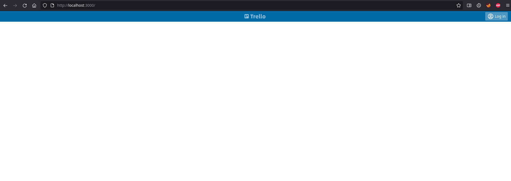

# Test Session Report

## __Mission__

To explore, experience, and experiment with the API in order to find how the FE app uses it and to figure out what makes sense to test on the API level.

## __Datetime__

13/11/2021 10:30

## __Duration__

4h

## __Testers__

Pavel Saman

## __Test execution time__

~ 15 %

## __Bug investigation time__

~ 25 %

## __Setup & admin time__

~ 10 %

## __Writing automated checks__

~ 50 %

## __Environment__

- firefox 94.0.1-1
- Postman 9.1.3
- FE app and API running on localhost
- Linux 5.14.16-artix1-1
- Xfce4 desktop environment

## __Notes__

- token is sent in headers when a logged in user works with the API
- API checks for boards:
  - create boards as anon user 
  - create boards as logged user 
  - get all boards as anon user 
  - get one particular board as anon user 
  - update a board as anon user
    - name
    - starred
  - update a board as logged user 
  - delete a board as anon user 
  - delete a board as logged user 
  - delete somebody else's board => should not be allowed (see bugs)

## __Bugs__

1. POST `/api/boards`: different BE validation for board name, I can create a board with no name via the API, but the FE app won't let me create a board with an empty name

```
POST /api/boards HTTP/1.1
User-Agent: PostmanRuntime/7.28.4
Accept: */*
Cache-Control: no-cache
Host: localhost:3000
Accept-Encoding: gzip, deflate, br
Connection: keep-alive
Content-Length: 0
 
HTTP/1.1 201 Created
Access-Control-Allow-Origin: *
x-powered-by: Express
vary: Origin, X-HTTP-Method-Override, Accept-Encoding
access-control-allow-credentials: true
cache-control: no-store, no-cache, must-revalidate, proxy-revalidate
pragma: no-cache
expires: 0
surrogate-control: no-store
access-control-expose-headers: Location
location: http://localhost:3001/boards/30283572489
x-content-type-options: nosniff
content-type: application/json; charset=utf-8
content-length: 83
etag: W/"53-fcg50kYBbr/Xr4ghLPqbsh84p2I"
date: Sat, 13 Nov 2021 09:37:54 GMT
connection: close
 
{
"user": 0,
"id": 30283572489,
"starred": false,
"created": "2021-11-13"
}
```

2. PATCH `/api/boards/:id`: I can edit a board so that it was created in the future:

    - this is a way to assign boards to users who might not wish for such a thing

```
PATCH /api/boards/42159708943 HTTP/1.1
Content-Type: application/json
User-Agent: PostmanRuntime/7.28.4
Accept: */*
Cache-Control: no-cache
Host: localhost:3000
Accept-Encoding: gzip, deflate, br
Connection: keep-alive
Content-Length: 111
 
{
"name": "hello",
"id": 42159708943,
"starred": true,
"created": "2022-11-13",
"user": 0
}
 
HTTP/1.1 200 OK
Access-Control-Allow-Origin: *
x-powered-by: Express
vary: Origin, Accept-Encoding
access-control-allow-credentials: true
cache-control: no-store, no-cache, must-revalidate, proxy-revalidate
pragma: no-cache
expires: 0
surrogate-control: no-store
x-content-type-options: nosniff
content-type: application/json; charset=utf-8
content-length: 101
etag: W/"65-PgoKl7q5InrE2N2ik/raLoRrzQc"
date: Sat, 13 Nov 2021 09:44:38 GMT
connection: close
 
{
"user": 0,
"id": 42159708943,
"starred": true,
"created": "2022-11-13",
"name": "hello"
}
```

3. PATCH `/api/boards/:id`: a random, even non-existent, user can be assigned as the owner of a board:

```
PATCH /api/boards/42159708943 HTTP/1.1
Content-Type: application/json
User-Agent: PostmanRuntime/7.28.4
Accept: */*
Cache-Control: no-cache
Host: localhost:3000
Accept-Encoding: gzip, deflate, br
Connection: keep-alive
Content-Length: 111
 
{
"name": "hello",
"id": 42159708943,
"starred": true,
"created": "2021-11-13",
"user": 8
}
 
HTTP/1.1 200 OK
Access-Control-Allow-Origin: *
x-powered-by: Express
vary: Origin, Accept-Encoding
access-control-allow-credentials: true
cache-control: no-store, no-cache, must-revalidate, proxy-revalidate
pragma: no-cache
expires: 0
surrogate-control: no-store
x-content-type-options: nosniff
content-type: application/json; charset=utf-8
content-length: 101
etag: W/"65-Dr3tqRlTXL/OK5hsw91stVQ9b7E"
date: Sat, 13 Nov 2021 09:45:42 GMT
connection: close
 
{
"user": 8,
"id": 42159708943,
"starred": true,
"created": "2021-11-13",
"name": "hello"
}
```

4. PATCH `/api/boards/:id`: `starred` could beset to value `0` or `1` or any value (boolean, string, object, array) really, the API says 200 OK, but such a board won't be show on the FE:

```
PATCH /api/boards/42159708943 HTTP/1.1
Content-Type: application/json
User-Agent: PostmanRuntime/7.28.4
Accept: */*
Cache-Control: no-cache
Host: localhost:3000
Accept-Encoding: gzip, deflate, br
Connection: keep-alive
Content-Length: 108
 
{
"name": "hello",
"id": 42159708943,
"starred": 0,
"created": "2021-11-13",
"user": 0
}
 
HTTP/1.1 200 OK
Access-Control-Allow-Origin: *
x-powered-by: Express
vary: Origin, Accept-Encoding
access-control-allow-credentials: true
cache-control: no-store, no-cache, must-revalidate, proxy-revalidate
pragma: no-cache
expires: 0
surrogate-control: no-store
x-content-type-options: nosniff
content-type: application/json; charset=utf-8
content-length: 98
etag: W/"62-2YWpPzjIrC2It9hMhbaNed5/+jM"
date: Sat, 13 Nov 2021 09:48:03 GMT
connection: close
 
{
"user": 0,
"id": 42159708943,
"starred": 0,
"created": "2021-11-13",
"name": "hello"
}
```



5. PATCH `/api/boards/:id`: object injection; possible security problem:

```
PATCH /api/boards/42159708943 HTTP/1.1
Content-Type: application/json
User-Agent: PostmanRuntime/7.28.4
Accept: */*
Cache-Control: no-cache
Host: localhost:3000
Accept-Encoding: gzip, deflate, br
Connection: keep-alive
Content-Length: 124
 
{
"name": "hello",
"id": 42159708943,
"starred": false,
"created": "2021-11-13",
"user": 0,
"a": 1
}
 
HTTP/1.1 200 OK
Access-Control-Allow-Origin: *
x-powered-by: Express
vary: Origin, Accept-Encoding
access-control-allow-credentials: true
cache-control: no-store, no-cache, must-revalidate, proxy-revalidate
pragma: no-cache
expires: 0
surrogate-control: no-store
x-content-type-options: nosniff
content-type: application/json; charset=utf-8
content-length: 112
etag: W/"70-9YUXNIWnYPRLemRGaDkP/nz+/Ms"
date: Sat, 13 Nov 2021 09:51:38 GMT
connection: close
 
{
"user": 0,
"id": 42159708943,
"starred": false,
"created": "2021-11-13",
"name": "hello",
"a": 1
}
```

the DB will then contain:

```json
{
  "boards": [
    {
      "user": 0,
      "id": 42159708943,
      "starred": false,
      "created": "2021-11-13",
      "name": "hello",
      "a": 1
    }
  ]
}
```

6. POST `/api/boards`: missing validations on `name` property:

```
POST /api/boards HTTP/1.1
Content-Type: application/json
User-Agent: PostmanRuntime/7.28.4
Accept: */*
Cache-Control: no-cache
Host: localhost:3000
Accept-Encoding: gzip, deflate, br
Connection: keep-alive
Content-Length: 18
 
{
"name": []
}
 
HTTP/1.1 201 Created
Access-Control-Allow-Origin: *
x-powered-by: Express
vary: Origin, X-HTTP-Method-Override, Accept-Encoding
access-control-allow-credentials: true
cache-control: no-store, no-cache, must-revalidate, proxy-revalidate
pragma: no-cache
expires: 0
surrogate-control: no-store
access-control-expose-headers: Location
location: http://localhost:3001/boards/4668207712
x-content-type-options: nosniff
content-type: application/json; charset=utf-8
content-length: 96
etag: W/"60-44duTD5Bu9jUOCswuXEsShl7004"
date: Sat, 13 Nov 2021 10:03:28 GMT
connection: close
 
{
"name": [],
"user": 0,
"id": 4668207712,
"starred": false,
"created": "2021-11-13"
}
```

this will be shown as "[]" (string) on home page, but no name will be shown on board detail page, so the array is interpreted there

7. 500 for incorrect payload:

    - this is a problem on different endpoints, namely: POST `/api/boards`, POST `/api/login`

```
POST /api/boards HTTP/1.1
Content-Type: application/json
User-Agent: PostmanRuntime/7.28.4
Accept: */*
Cache-Control: no-cache
Host: localhost:3000
Accept-Encoding: gzip, deflate, br
Connection: keep-alive
Content-Length: 22
 
{
"name": "hello"
 
HTTP/1.1 500 Internal Server Error
Access-Control-Allow-Origin: *
x-powered-by: Express
vary: Origin, Accept-Encoding
access-control-allow-credentials: true
cache-control: no-store, no-cache, must-revalidate, proxy-revalidate
pragma: no-cache
expires: 0
surrogate-control: no-store
x-content-type-options: nosniff
content-type: application/json; charset=utf-8
content-length: 30
etag: W/"1e-81iaFEe7ZicgVi4Mkp2NGcR504A"
date: Sat, 13 Nov 2021 10:10:03 GMT
connection: close
 
"Unexpected end of JSON input"
```

8. in general, there seems to be no backend validations, which is a problem since wrong, malicious, undesired data might end up in the DB; validations in the following domains should be considered:

    - validations for undesired empty values
    - validation for wrong data types
    - validation for out-of-boundary values
    - validations for incorrect payload
    - validations for business logic in general

    These validations should be accompanied by appropriate FE validations, both should exist since each serves a different purpose; FE validations should help user make better decisions and should make it faster to work with the system since there's no request-response involved, BE validations should make sure no undesired data will be stored

9. there is missing authorization scheme:

    - an anon user can PATCH somebody else's board

10. Sending no access token results in 500:

    - I suspect this might be a case on different endpoints

```
GET /api/boards HTTP/1.1
Accept: application/json
Authorization: Bearer
User-Agent: PostmanRuntime/7.28.4
Cache-Control: no-cache
Host: localhost:3000
Accept-Encoding: gzip, deflate, br
Connection: keep-alive
 
HTTP/1.1 500 Internal Server Error
Access-Control-Allow-Origin: *
x-powered-by: Express
vary: Origin, Accept-Encoding
access-control-allow-credentials: true
cache-control: no-store, no-cache, must-revalidate, proxy-revalidate
pragma: no-cache
expires: 0
surrogate-control: no-store
content-security-policy: default-src 'none'
x-content-type-options: nosniff
content-type: text/html; charset=utf-8
content-encoding: gzip
date: Sat, 13 Nov 2021 12:00:20 GMT
connection: close
transfer-encoding: chunked
 
<!DOCTYPE html>
<html lang="en">
<head>
<meta charset="utf-8">
<title>Error</title>
</head>
<body>
<pre>TypeError: Cannot read properties of undefined (reading &#39;replace&#39;)<br> &nbsp; &nbsp;at parseJWT (/home/pavel/testing/slido/trelloapp-vue-vite-ts/vite.config.ts:60:36)<br> &nbsp; &nbsp;at module2.exports (/home/pavel/testing/slido/trelloapp-vue-vite-ts/vite.config.ts:66:24)<br> &nbsp; &nbsp;at Layer.handle [as handle_request] (/home/pavel/testing/slido/trelloapp-vue-vite-ts/node_modules/express/lib/router/layer.js:95:5)<br> &nbsp; &nbsp;at trim_prefix (/home/pavel/testing/slido/trelloapp-vue-vite-ts/node_modules/express/lib/router/index.js:317:13)<br> &nbsp; &nbsp;at /home/pavel/testing/slido/trelloapp-vue-vite-ts/node_modules/express/lib/router/index.js:284:7<br> &nbsp; &nbsp;at Function.process_params (/home/pavel/testing/slido/trelloapp-vue-vite-ts/node_modules/express/lib/router/index.js:335:12)<br> &nbsp; &nbsp;at next (/home/pavel/testing/slido/trelloapp-vue-vite-ts/node_modules/express/lib/router/index.js:275:10)<br> &nbsp; &nbsp;at urlencodedParser (/home/pavel/testing/slido/trelloapp-vue-vite-ts/node_modules/body-parser/lib/types/urlencoded.js:91:7)<br> &nbsp; &nbsp;at Layer.handle [as handle_request] (/home/pavel/testing/slido/trelloapp-vue-vite-ts/node_modules/express/lib/router/layer.js:95:5)<br> &nbsp; &nbsp;at trim_prefix (/home/pavel/testing/slido/trelloapp-vue-vite-ts/node_modules/express/lib/router/index.js:317:13)</pre>
</body>
</html>
```

11. there is POST `/api/reset` endpoint with no authorization; possible to delete the whole database; no authentication or authorization is required

12. there seems to be a problem with cached users; when the DB is seeded, POST `/api/login` won't be successful, the cache could be refreshed with a request to GET `/api/users/`, but that's probably a terrible workaround

    - this seems to be a problem only in checks, but it might cause other problems in the app that I'm not aware of right now

## __Issues__
