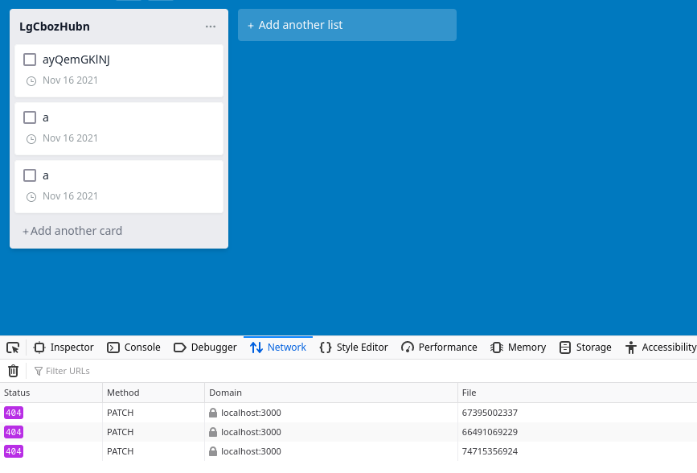

# Test Session Report

## __Mission__

To write some UI checks, most likely boards, lists, and cards.
Also wrote some checks for signup and login process and FE validations.

## __Datetime__

13/11/2021 18:30

## __Duration__

2.5h

## __Testers__

Pavel Saman

## __Test execution time__

~ 10 %

## __Bug investigation time__

~ 5 %

## __Setup & admin time__

~ 10 %

## __Writing automated checks__

~ 75 %

## __Environment__

- firefox 94.0.1-1
- Postman 9.1.3
- FE app and API running on localhost
- Linux 5.14.16-artix1-1
- Xfce4 desktop environment

## __Notes__

- it's possible to reorder cards on a list
- it's also possible to drag cards between lists

## __Bugs__

1. when I try to reorder cards and they do not exist enymore, there is no notification:

2. a card could be assigned to a non-existent list or even board; missing validations that `boardId` and `listId` exist before creating a resource

## __Issues__
