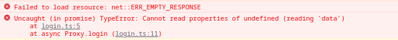

# Test Session Report

## __Mission__

Write more checks for login process
Ended up checking API login and signup, plus some FE things like 500 on login and signup

## __Datetime__

14/11/2021 10:00

## __Duration__

13:30

## __Testers__

Pavel Saman

## __Test execution time__

~ 20 %

## __Bug investigation time__

~ 20 %

## __Setup & admin time__

~ 10 %

## __Writing automated checks__

~ 50 %

## __Environment__

- firefox 94.0.1-1
- Postman 9.1.3
- FE app and API running on localhost
- Linux 5.14.16-artix1-1
- Xfce4 desktop environment

## __Notes__

## __Bugs__

1. loading home page with the "Get started!" text means 110 requests and about 5.8 MB of data transferred; that's queite a lot of one page with not much on it

    - one JS file is over 1 MB in size, several other ones close to 1 MB

2. no dot after the second sentence on the signup page

login page does cointain the dot: "Don’t have an account? Sign up here."

3. warnings in JS console

4. there are no FE or BE validations for string lengths; I probably mentioned this bug earlier as well

5. login screen picture is out of proportions and is not shown nicely on a mobile device

similarly for signup page:

and homepage in its other version:

6. login and signup page elements like input boxes are too narrow on mobile devices

7. it's hard to scroll on a board detail page on mobile devices; many times, lists are moved instead of moving the page

8. placeholder on homepage is not readable on mobile devices

9. uncaught exception when there is a network error:

    - I suspect this might happen at other places in the app as well
    - the FE app doesn't seem to notife the user in any way

10. there is no meaningful error message in case the server returns 500; I experienced this error on login and signup page

    - I suspect this might happen at other places in the app as well

11. missing API documentation

    - some form (e.g. automatically generated) of API documentation is usually helpful to devs, testers, and other people; it takes much longer to figure out what an API does with no documentation

## __Issues__
